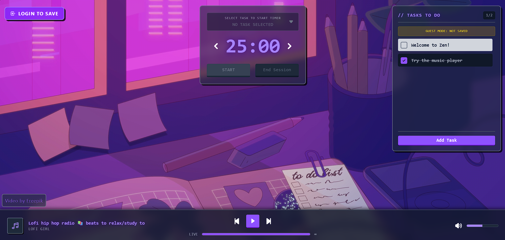

# Zen

A minimalist, full-stack productivity and task management app built with React, Golang, and PostgreSQL. Featuring task tracking, a timer, and interactive stats.

## Tech Stack

**Backend:**
- Go
- Gin Web Framework
- GORM (ORM)
- JWT Authentication

**Frontend:**
- React
- TypeScript
- Vite
- Tailwind CSS
- Framer Motion
- Axios

**Database:**
- PostgreSQL

## Main Features
- User Authentication
- Task Management
- Timer
- Session Tracking
- Music Player
- User Profile

## Project Structure

```
├── backend/                 # Go backend API
│   ├── internal/
│   │   ├── handler/         # Request handlers
│   │   ├── service/         # Business logic
│   │   ├── repository/      # Database queries
│   │   ├── middleware/      # Auth middleware
│   │   ├── model/           # Data models
│   │   ├── router/          # Route definitions
│   │   ├── database/        # DB connection
│   │   └── utils/           # Utilities (JWT, passwords)
│   └── main.go
├── frontend/                # React frontend
│   ├── src/
│   │   ├── components/      # React components
│   │   ├── services/        # API calls
│   │   ├── types/           # TypeScript types
│   │   └── App.tsx
│   └── vite.config.ts
└── docker-compose.yml
```

## API Endpoints

The backend provides REST API endpoints for:
- User authentication (login, register)
- Task operations (CRUD)
- Session management
- User profile management

## Notes

This project is for training and portfolio purposes.


## Screenshot Preview

